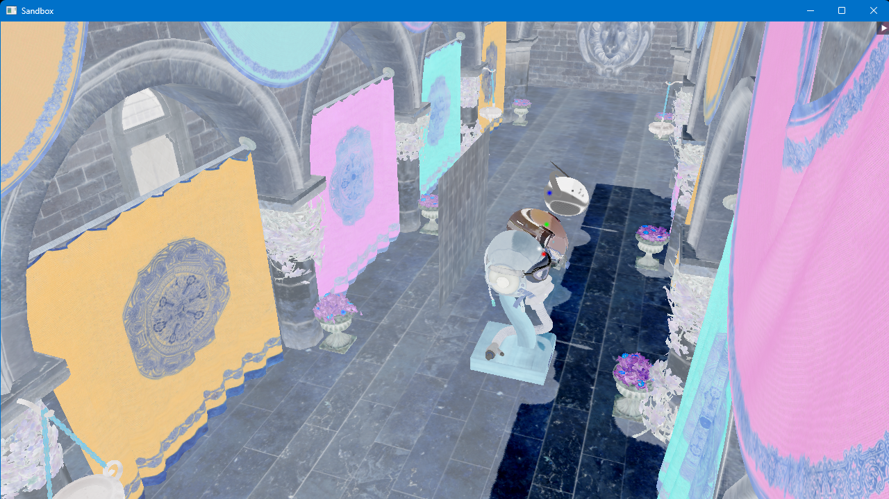

# OpenGL Sandbox Library
An OpenGL C++ library for creating 3D scenes.\
**No longer maintained.**

## Features
###  Blinn-Phong lighting model with directional/point lights and normal mapping

### External model loading

### Scene Graphs

### Shadow Mapping

### Post Processing Layer

## Dependencies
[GLFW](https://github.com/glfw/glfw) for window creation and input handling.\
[GLM](https://github.com/g-truc/glm) for math operations.\
[Dear ImGui](https://github.com/ocornut/imgui) for GUI rendering.\
[stb_image](https://github.com/nothings/stb/blob/master/stb_image.h) for image loading.\
[Assimp](https://github.com/assimp/assimp) for model loading.